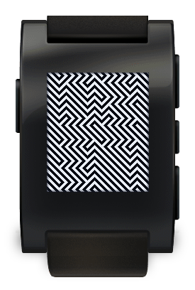
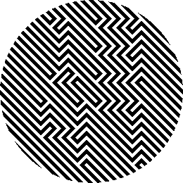

Illudere watchface
==================

A watchface for Pebble, built out of an optical illusion.

And on a Pebble Round 2, where the finer stripes make it harder still:

Although it may not be immediately apparent, there are 4 large digits on this
face. The background consists of lines going one direction. The foreground, or
the digits, has lines in the other direction. The edges of digits appear as
corners in these lines, so where ever you see a corner, try to follow it to see
the rest of the edge of a digit. Once you can see one, it shouldn't be hard to
find the rest.

Supported watches
-----------------

The layout is worked out at runtime from the size and shape of the display, so
one build covers every Pebble that has ever shipped, including the new ones:

| Platform  | Watch                          | Display          |
| --------- | ------------------------------ | ---------------- |
| `aplite`  | Pebble, Pebble Steel           | 144x168 b&w      |
| `basalt`  | Pebble Time, Time Steel        | 144x168 colour   |
| `chalk`   | Pebble Time Round              | 180x180 round    |
| `diorite` | Pebble 2                       | 144x168 b&w      |
| `flint`   | Pebble 2 Duo                   | 144x168 b&w      |
| `emery`   | Pebble Time 2                  | 200x228 colour   |
| `gabbro`  | Pebble Round 2                 | 260x260 round    |

On a round watch the digits are sized to fit the inscribed square rather than
the full width, so nothing falls off the edge of the circle. The face is drawn
in black and white on every platform: the illusion depends on the contrast, and
colour would only weaken it.

Building
--------

Install [the Pebble SDK][sdk], then:

    pebble build
    pebble install --emulator emery   # or install --phone <ip> for a real watch

That produces `build/illudere.pbw` containing binaries for all seven platforms.

The [prebuilt download][0] is the original 2013 build. It still runs on an
original Pebble, but it predates every watch after the first one — build from
source for anything newer.

Credits
-------

Thanks to [RichardG][2] for the assets. Based on the [Kisai Optical Illusion
watch from TokyoFlash][1].

[0]: https://s3.amazonaws.com/dmnd-public/pebble/illudere.pbw
[1]: http://www.tokyoflash.com/en/watches/kisai/optical_illusion/
[2]: http://www.mypebblefaces.com/view?fID=39&aName=richardg&pageTitle=Illusion&auID=21
[sdk]: https://developer.repebble.com/sdk/
